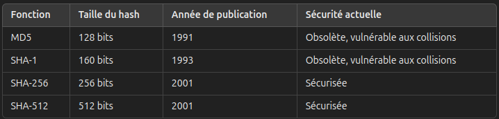
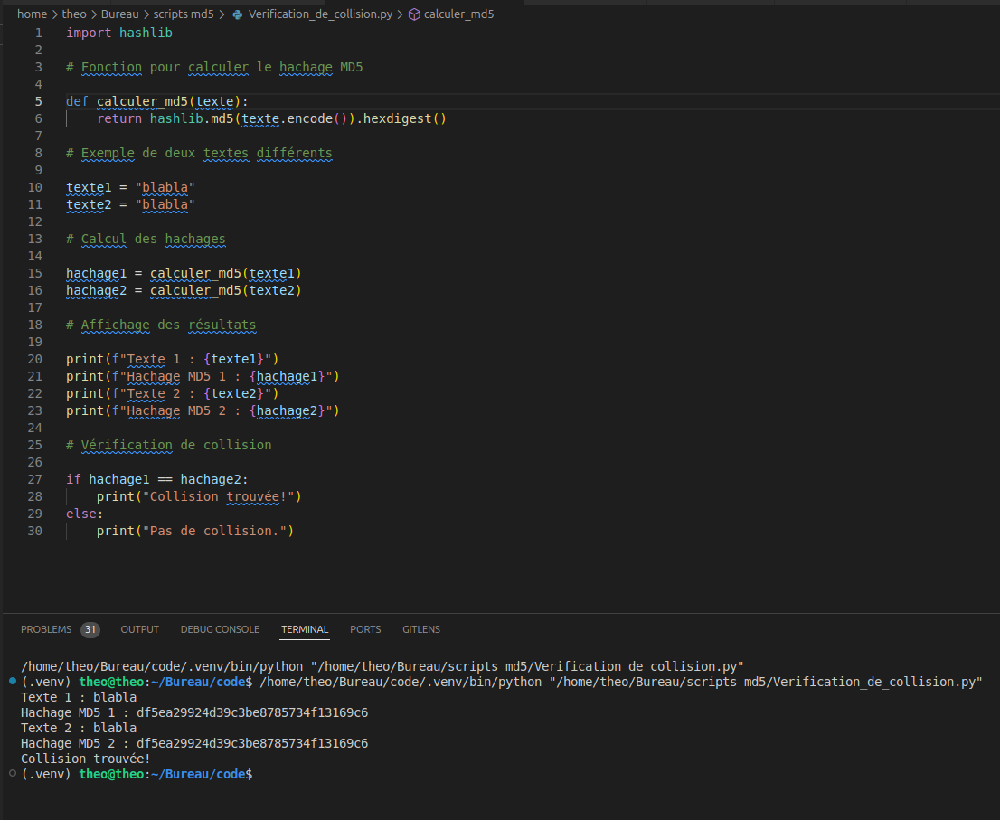
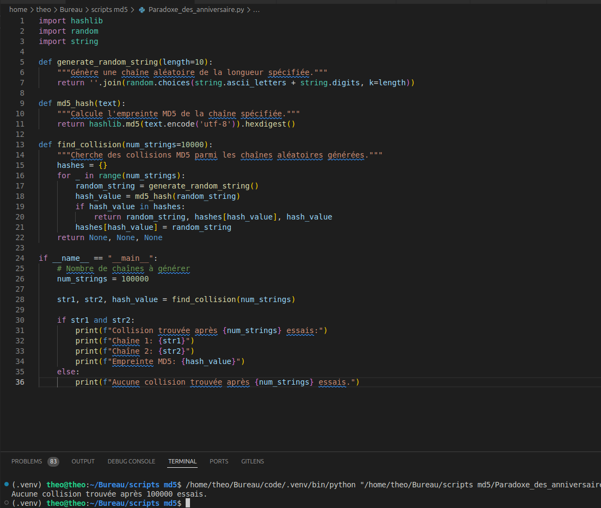
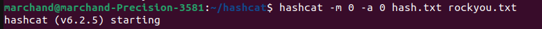
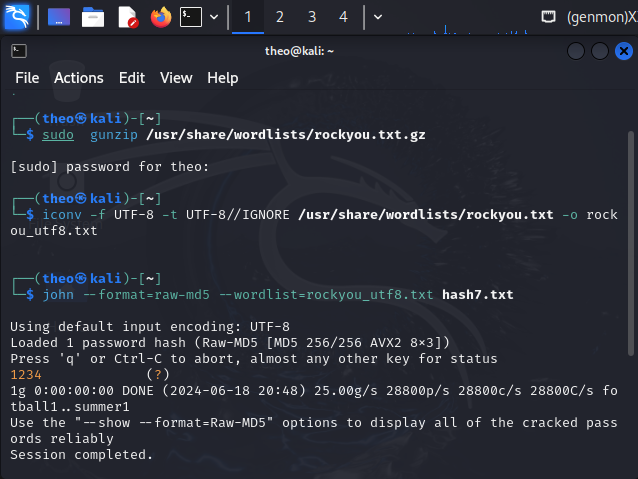
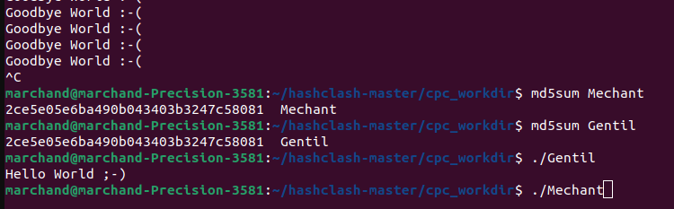

# SAE_Cryptographie

Le projet a été réalisé par :
- Axel Marchand/Couette21
- Théo Beausaert/Thorsyss

---

## **Introduction**

Notre objectif est d'explorer la faille de collision de MD5, en nous concentrant sur l'introduction théorique et pratique aux concepts de cryptographie.

---

## **Table des matières**

1. [**Présentation du hachage**](#présentation-du-hachage) 📜
2. [**Fonctionnement des collisions**](#Fonctionnement-des-collisions)
3. [**Découverte des différentes fonctions en pratique**](#découverte-des-différentes-fonctions-en-pratique) 🔍
4. [**Programme de vérification de collision**](#programme-de-vérification-de-collision) 🛠️
5. [**Programme de création de collision**](#programme-de-création-de-collision) 🛠️
6. [**Paradoxe des anniversaires**](#paradoxe-des-anniversaires) 🎉
7. [**Craquage de mot de passe avec Hashcat**](#craquage-de-mot-de-passe-avec-hashcat) 💻
8. [**Craquage de mot de passe avec John the Ripper**](#Craquage-de-mot-de-passe-avec-John-the-Ripper) 🔍
9. [**Hashclash**](#Hashclash) 🎉
10. [**Préparer l'attaque**](#préparer-lattaque) 🚀
    - [**Trouver une façon de s'introduire**](#trouver-une-façon-de-sintroduire) 🔍
    - [**Attaque**](#attaque) ⚔️
    - [**Rapport réussi 20/20**](#rapport-réussi-2020) 📊

---

## **Présentation du hachage**

Qu'est-ce que le hachage ?
Le hachage est une fonction cryptographique qui transforme une entrée (ou message) de taille variable en une sortie (ou hash) de taille fixe. Cette sortie est souvent représentée sous forme de chaîne de caractères hexadécimaux. Les fonctions de hachage sont largement utilisées en informatique pour des applications telles que la vérification de l'intégrité des données, le stockage sécurisé des mots de passe, et les signatures numériques.

---

## **Fonctionnement des collisions**

Le schéma montre comment les collisions de hachage sont utilisées pour tromper les systèmes de sécurité. Un attaquant crée un bloc de collision qui, combiné avec un entête commun, génère la même valeur de hachage pour deux fichiers différents : un fichier inoffensif et un malware. En concaténant ce bloc de collision et l'entête avec soit le fichier gentil, soit le malware, les deux fichiers semblent identiques aux systèmes de sécurité qui utilisent des valeurs de hachage pour vérifier l'intégrité des fichiers. Cela permet au malware de passer pour un fichier sûr et de contourner les protections.

---

## **Découverte des différentes fonctions en pratique**

Nous explorerons différentes fonctions de hachage et leur utilisation pratique pour comprendre leur fonctionnement et leurs limites.

-MD5 (Message Digest Algorithm 5)
Taille du hash : 128 bits (16 octets)

-SHA-1 (Secure Hash Algorithm 1)
Taille du hash : 160 bits (20 octets)

-SHA-256 (Secure Hash Algorithm 256)
Taille du hash : 256 bits (32 octets)

-SHA-512 (Secure Hash Algorithm 512)
Taille du hash : 512 bits (64 octets)

---
## **Programme-de-création-de-collision**

---
## **Programme de vérification de collision**

Ce programme permet de vérifier si deux fichiers différents produisent le même hash MD5.

---

## **Programme de recherche de hash specifique**

Nous avons développé un programme pour rechercher un hash spécifique. Le principe est simple : créer un fichier contenant une pop-up, modifier le contenu sans altérer sa fonction de base, et ajouter des zéros afin que notre programme puisse trouver le hash spécifique.

---

## **Paradoxe des anniversaires**

Le paradoxe des anniversaires montre qu'avec un nombre relativement faible de tentatives, il y a une probabilité élevée de trouver deux entrées avec le même hash.

---

## **Craquage de mot de passe avec Hashcat**

Hashcat est un outil puissant pour craquer les mots de passe en exploitant la puissance des GPU pour accélérer le processus.

---
## **Craquage de mot de passe avec John the Ripper**

John the Ripper est un outil puissant pour craquer les mots de passe en utilisant des techniques de cryptanalyse et de force brute pour identifier les mots de passe à partir de leurs hachages. Cet outil est flexible et peut être utilisé sur une variété de systèmes pour effectuer des attaques par dictionnaire, par force brute et basées sur des règles.

---

## **Hashclash**

Le hashclash est une technique d'attaque par collision de hachage, où un attaquant trouve deux entrées différentes qui produisent la même valeur de hachage. Cela permet de manipuler des fichiers ou des messages de sorte qu'ils aient des signatures de hachage identiques, trompant ainsi les systèmes de vérification d'intégrité. Hashclash est souvent utilisé pour contourner les mesures de sécurité en faisant passer du contenu malveillant pour du contenu inoffensif.

### Source

<li>https://www.win.tue.nl/hashclash/</li>
<li>https://www.win.tue.nl/hashclash/ChosenPrefixCollisions/</li>
<li>https://www.win.tue.nl/hashclash/SoftIntCodeSign/</li>
<li>https://thomaspeyrin.github.io/web/assets/docs/papers/Peyrin-PhDThesis.pdf</li>
<li>https://eprint.iacr.org/2004/199.pdf</li>

### La collision

Ici, l'on remarque une une collision entre deux fichier qui n'ont pas le même contenu.

## **Préparer l'attaque**

### **Trouver une façon de s'introduire**

Nous explorerons différentes méthodes d'attaque, y compris l'exploitation de mises à jour de système ou d'applications et les vulnérabilités de gestion de mots de passe. L'objectif est d'identifier les points faibles dans les systèmes de sécurité actuels.

### **Attaque**

Nous mettrons en pratique les concepts appris pour simuler des attaques et évaluer leur succès.

### **Rapport réussi 20/20**

Nous conclurons notre projet en partageant nos résultats et en tirant des conclusions sur la sécurité des systèmes utilisant MD5.

